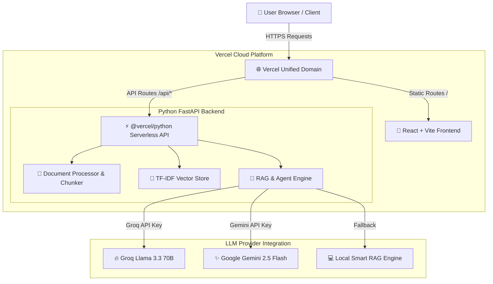

# 🚀 DocuMind AI — Enterprise RAG & Autonomous Agent System

[](https://rag-multi-agent-enterprise.vercel.app)
[](https://fastapi.tiangolo.com)
[](https://react.dev)
[](https://tailwindcss.com)
[](https://groq.com)
[](LICENSE)

**DocuMind AI** is an enterprise-grade Retrieval-Augmented Generation (RAG) dashboard and multi-tool agent workspace. It enables instant multi-format document ingestion (`.pdf`, `.txt`, `.csv`, `.docx`), vector similarity search with TF-IDF cosine matching, interactive source grounding citations, and automated agent tools for email drafting and task management.

---

## 🌐 Live Production Application

### 🔗 **[https://rag-multi-agent-enterprise.vercel.app](https://rag-multi-agent-enterprise.vercel.app)**

> Both the **React Frontend** and **FastAPI Python Backend** are deployed together on Vercel as a unified full-stack serverless application with zero external server hosting fees.

---

## ✨ Key Features

- 📄 **Multi-Format Document Ingestion**: Drag & drop or browse `.pdf`, `.txt`, `.csv`, and `.docx` files.
- ⚡ **Automated Token Chunking**: Splits uploaded documents into 500-token chunks with 50-token overlap.
- 🔍 **Pure Python Vector Store**: Calculates TF-IDF vectors and Cosine Similarity scores in real-time with zero external DB dependencies.
- 🤖 **Multi-LLM Provider Engine**: Powered by **Groq Llama 3.3 70B** and **Google Gemini Free Tier** with local fallback.
- 🎯 **Grounding Evidence Citations**: Interactive citation badges `[DocName: Section]` with confidence match percentage scores and modal snippet inspection.
- ⚡ **Autonomous Agent Tools**:
  - ✉️ **Email Draft Generator**: Formats executive summaries into ready-to-send email drafts.
  - 📌 **Interactive Task Manager**: Automatically creates and manages tasks with priorities (High/Med/Low), assignees, and deadlines.
  - 📑 **Report Exporter**: Generates structured executive markdown reports.
- 🎨 **Enterprise Glassmorphism UI**: Built with React, Vite, Lucide Icons, and Tailwind CSS.

---

## 🏗️ System Architecture



---

## 📁 Repository Directory Structure

```
rag-multi-agent-enterprise/
├── api/                       # Vercel Serverless Function Entrypoint
│   ├── index.py               # Exports FastAPI app for Vercel
│   └── app/                   # Bundled Python backend modules
├── backend/                   # Local FastAPI Backend Application
│   ├── app/
│   │   ├── api/               # API Router endpoints (documents, chat, tools)
│   │   ├── services/          # Document Processor, Vector Store, RAG Engine
│   │   ├── models.py          # Pydantic Schemas
│   │   ├── config.py          # Environment settings
│   │   └── main.py            # FastAPI Application Root
│   └── sample_data/           # Sample enterprise demo documents
├── frontend/                  # React + Vite + Tailwind CSS Frontend
│   ├── src/
│   │   ├── components/        # Sidebar, ChatWorkspace, ActionCenter, Modals
│   │   ├── context/           # AppContext state manager
│   │   ├── services/          # Axios API Client
│   │   └── App.jsx
│   └── package.json
├── vercel.json                # Vercel Unified Deployment Configuration
├── requirements.txt           # Python dependencies for Serverless runtime
└── README.md
```

---

## 🔒 Proprietary & Copyright Notice

Copyright (c) 2026 **Mohamed Shammas**. All rights reserved.

This software and source code are proprietary. Unauthorized copying, modification, editing, redistribution, or commercial use is strictly prohibited. See the [`LICENSE`](LICENSE) file for complete details.
